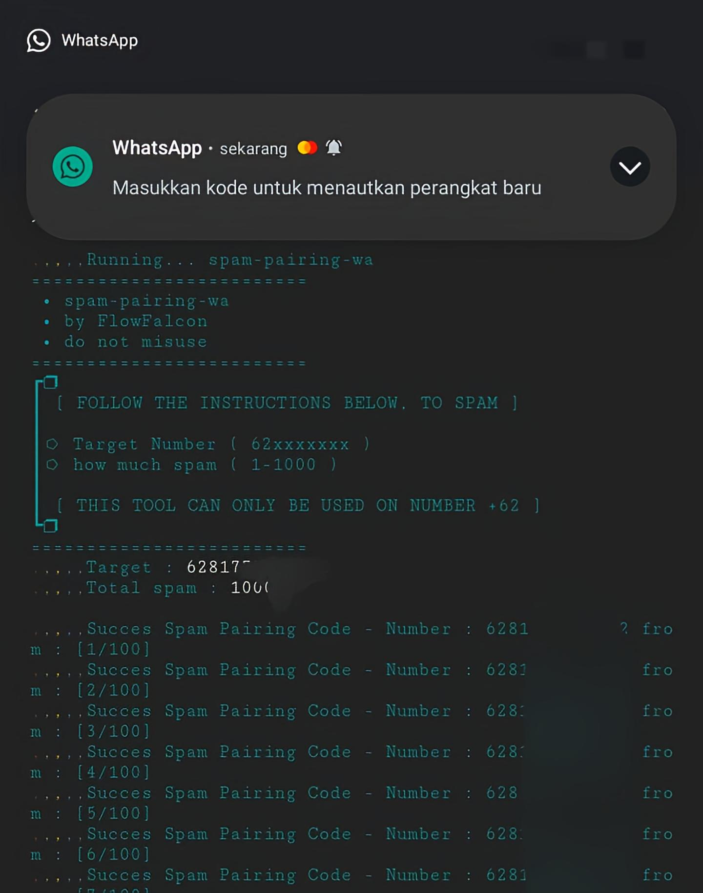

# spam-pairing-wa
Tools Spam Pairing Whatsapp using Javascript and Nodejs
<div align="center">
  <p>
    
  </p>
  <p> THIS TOOLS ONLY AVAILABLE ON NUMBER +62<br>
  IF IT'S ON ANOTHER NUMBER IT'S A BIG LUCK</p>
  <p>This tool is used to spam Whatsapp<br>
    pairing codes and can cause the victim to get lots of notifications<br>
    This is only used for small pranks, do not use it for crime.  </p>
</div>

## Install in Termux
```bash
apt update && apt upgrade -y
apt install nodejs git -y
git clone https://github.com/FlowFalcon/spam-pairing-wa
```

## Install in Distro Linux
```bash
sudo apt update && apt upgrade
sudo apt install nodejs git
git clone https://github.com/FlowFalcon/spam-pairing-wa
```

## Install in Windows with Gitbash
You need to Install Nodejs and Git on your Device
```bash
git clone https://github.com/FlowFalcon/spam-pairing-wa
```

## Run spam-pairng-wa
```bash
cd spam-pairing-wa
npm install
npm start
```

## Support Me
<ul>
  <li><strong>Tiktok</strong>: <a href="https://www.tiktok.com/@flow.falcon">@flow.falcon</a></li>
  <li><strong>Website</strong>: <a href="https://www.flowfalcon.xyz/">https://www.flowfalcon.xyz/</a></li>
  <li><strong>Github</strong>: <a href="https://github.com/FlowFalcon">https://github.com/FlowFalcon</a></li>
</ul>
